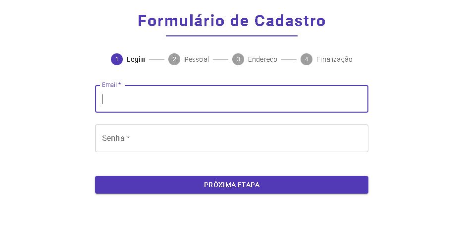

# Formix App

Esse é um projeto para treinamento da Biblioteca React no qual foi implementado useState, useContext, useEffects e hooks customizados, animações com Lottie, organização de código, biblioteca de componentes Material UI. 

.

## Tecnologias utilizadas

- ReactJS
- Material UI
- Lottie

.